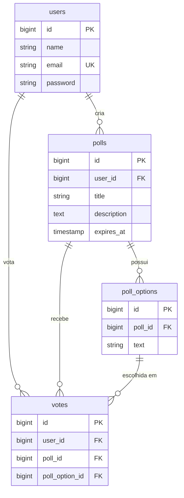

<h1 align="center">🗳️ Impar Enquetes</h1>

<p align="center">
  Sistema de enquetes (polls) full-stack com votação e resultados em <strong>tempo real</strong>.<br>
  Desafio técnico — Impar Tecnologias.
</p>

<p align="center">
  <a href="https://enquetes.fontepro.online"><strong>🔗 Aplicação ao vivo</strong></a> ·
  <a href="https://api-enquetes.fontepro.online/up"><strong>❤️ Health check da API</strong></a>
</p>

---

## 📖 Sobre o projeto

Aplicação web completa onde usuários autenticados criam enquetes, votam nas enquetes de outros e acompanham os resultados **atualizando ao vivo**, sem recarregar a página. Front-end e back-end são projetos separados, comunicando-se por uma API RESTful.

O foco foi organização de código, separação clara de responsabilidades, boas práticas de segurança e uma experiência de usuário fluida.

---

## 🛠️ Stack técnica

| Camada | Tecnologia | Motivo da escolha |
| --- | --- | --- |
| **Back-end** | Laravel 13 (PHP 8.4) | Framework maduro; autenticação, ORM, validação, filas e broadcasting nativos. Usa PDO por baixo. |
| **Front-end** | React 18 + Vite | Requisito do desafio. Vite pela velocidade (o Create React App foi descontinuado). |
| **Banco** | MySQL 8 | Requisito do desafio; integração transparente via Eloquent. |
| **Autenticação** | Laravel Sanctum (tokens) | Padrão oficial para SPAs: tokens revogáveis, armazenados com hash no banco. |
| **Real-time** | Laravel Reverb + Laravel Echo | Servidor WebSocket first-party do Laravel; Echo cuida de reconexão e canais. |
| **Estilização** | Tailwind CSS | Produtividade e consistência visual em prazo curto. |
| **Gráficos** | Recharts | Biblioteca declarativa, feita para React. |
| **E-mail** | Laravel Mail + filas | Envio assíncrono para não travar a resposta do voto. |

---

## ✨ Funcionalidades

### Obrigatórias
- ✅ Cadastro, login, logout e **recuperação de senha**
- ✅ Proteção de rotas (só autenticados criam enquetes e votam)
- ✅ CRUD de enquetes (título, descrição, 2–8 opções, data de expiração)
- ✅ Edição e exclusão restritas ao criador (via Policy)
- ✅ Um voto por usuário por enquete (validação + constraint no banco)
- ✅ **Resultados em tempo real** via WebSocket

### Opcionais implementados
- ✅ E-mail de confirmação ao votante e de aviso ao dono da enquete
- ✅ Barra de progresso e gráfico de barras nos resultados
- ✅ Enquetes em destaque (mais votadas) e busca por título/descrição
- ✅ Rate limiting nos votos (10/min por usuário)
- ✅ Proteção contra SQL Injection, XSS, CSRF e IDOR
- ✅ Validação forte de e-mail (formato + DNS)
- ✅ Compartilhamento de enquete via link
- ✅ Histórico de votos do usuário

---

## 🗂️ Estrutura do repositório

```
impar-enquetes/
├── backend/        # API Laravel 13
├── frontend/       # SPA React + Vite
└── README.md
```

---

## 🧩 Diagrama do banco de dados



> **Decisão-chave:** a tabela `votes` guarda `poll_id` mesmo sendo derivável de `poll_option_id`. Essa redundância proposital permite a constraint **`UNIQUE(user_id, poll_id)`**, que garante "um voto por usuário por enquete" no nível do banco — resistente a condições de corrida.

---

## 🚀 Rodando localmente

### Pré-requisitos
- PHP 8.3+ (recomendado 8.4) · Composer · Node 18+ · MySQL 8

### 1. Backend

```bash
cd backend
composer install
cp .env.example .env
php artisan key:generate
# configure as credenciais do banco no .env, depois:
php artisan migrate
php artisan install:api          # Sanctum (se ainda não instalado)
php artisan install:broadcasting # Reverb (se ainda não instalado)
```

### 2. Frontend

```bash
cd frontend
npm install
cp .env.example .env
# ajuste VITE_API_URL e as variáveis do Reverb no .env
```

### 3. Subir os 4 processos (cada um em um terminal)

```bash
# 1) API
cd backend && php artisan serve

# 2) Servidor WebSocket
cd backend && php artisan reverb:start

# 3) Worker da fila (e-mails)
cd backend && php artisan queue:work

# 4) Front-end
cd frontend && npm run dev
```

Acesse `http://localhost:5173`.

---

## 🔌 Rotas da API

Todas sob o prefixo `/api`. As protegidas exigem header `Authorization: Bearer {token}`.

| Método | Rota | Protegida | Descrição |
| --- | --- | :---: | --- |
| POST | `/register` | ➖ | Cadastro |
| POST | `/login` | ➖ | Login |
| POST | `/forgot-password` | ➖ | Solicita link de reset |
| POST | `/reset-password` | ➖ | Redefine a senha |
| POST | `/logout` | 🔒 | Revoga o token atual |
| GET | `/me` | 🔒 | Dados do usuário logado |
| GET | `/polls` | 🔒 | Lista enquetes (`?search=`, `?sort=popular`) |
| POST | `/polls` | 🔒 | Cria enquete |
| GET | `/polls/{id}` | 🔒 | Detalhes da enquete |
| PUT | `/polls/{id}` | 🔒 | Edita (só o dono) |
| DELETE | `/polls/{id}` | 🔒 | Exclui (só o dono) |
| POST | `/polls/{id}/votes` | 🔒 | Vota (rate limit 10/min) |
| GET | `/my-votes` | 🔒 | Histórico de votos |

> A collection do Insomnia (`impar-enquetes-insomnia.json`) na raiz do repositório contém todas essas rotas prontas para importar.

---

## 🧠 Principais decisões técnicas

- **Sanctum em vez de JWT puro:** tokens revogáveis no logout (JWT stateless exigiria uma blacklist para o mesmo efeito).
- **Reverb (WebSocket) em vez de SSE:** ecossistema first-party; o mesmo código roda com Pusher só trocando variáveis de ambiente.
- **Broadcast imediato (`ShouldBroadcastNow`) para votos, fila para e-mails:** latência importa no tempo real; no e-mail, não — então ele vai para a fila e não atrasa a resposta do voto.
- **Form Requests + Policies:** validação e autorização isoladas do controller, que fica magro e legível.
- **Opções não editáveis após criação:** preserva a integridade dos votos já registrados.

---

## 🌐 Deploy

Deploy em **VPS Ubuntu 24.04** com:
- **Nginx** servindo a API (root em `/public`) e o build estático do front (SPA fallback para `index.html`)
- **PHP 8.4-FPM** dedicado (convivendo com outra versão na mesma máquina)
- **Certbot / Let's Encrypt** para HTTPS com renovação automática
- **Reverb** exposto via proxy WebSocket do Nginx (`/app` → `127.0.0.1:8080`)
- **Supervisor** mantendo o Reverb e o worker da fila rodando e reiniciando no boot

Arquivos de configuração de referência (Nginx e Supervisor) descritos em `/docs`.

---

## 🔭 Próximos passos

- Code-splitting no build do front (reduzir o bundle inicial)
- Testes automatizados (PHPUnit + Vitest)
- Canais privados no Reverb para dados sensíveis
- Migração da fila para Redis em cenário de alta escala

---

<p align="center">Desenvolvido por <strong>Daniel Moura</strong> · 2026</p>
